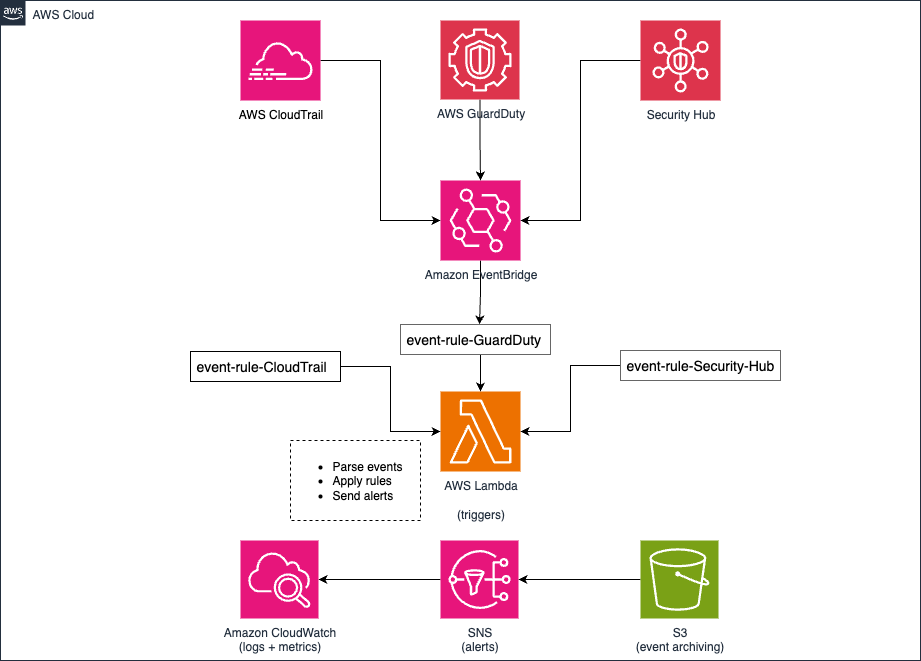

# 🛡 CNAPP Threat Detection Dashboard (AWS, Python, Terraform)

## 📌 Overview

This project implements a **Cloud-Native Application Protection Platform (CNAPP)** for AWS using modular Terraform and Python Lambda functions. It ingests and evaluates threat data from GuardDuty, Security Hub, and CloudTrail — providing real-time alerts and logging via EventBridge, CloudWatch, and SNS.

---

## 🎯 Key Features

- ⚙️ **Modular Terraform** (CloudTrail, Lambda, EventBridge, GuardDuty, Security Hub, IAM, S3)
- 🧠 **Python Threat Logic Engine**: Parse and evaluate findings, generate actionable alerts
- 🔁 **Event-Driven Architecture** via AWS EventBridge → Lambda
- 🪵 **Structured Logging** to CloudWatch and S3
- 🔔 **Alerts via SNS** (email/SMS-ready)
- 💰 **Low-cost footprint** (~$10–$25/month)

---

## 🧱 Architecture Diagram

> _High-level architecture of the deployed solution:_



---

## 🚀 Getting Started

### 📦 Requirements
- AWS CLI & credentials configured
- Terraform 1.5+
- Python 3.13+
- Zip utility (`zip`, `make`, or `python -m zipfile`)
- (Optional) AWS SNS topic/email subscription

### 🛠️ Deploy

```bash
# Prepare Lambda code
cd modules/lambda
zip -r build/threat_detection.zip threat_detection

# Deploy infrastructure
cd ../../terraform
terraform init
terraform apply

📂 Project Structure
cnapp_threat_detection_dashboard/
│
├── modules/
│   ├── cloudtrail/
│   ├── eventbridge/
│   ├── guardduty/
│   ├── lambda/
│   │   ├── threat_detection/
│   │   ├── build/
│   ├── iam/
│   ├── security_hub/
│   └── s3/
│
├── terraform/
│   ├── main.tf
│   ├── variables.tf
│   └── outputs.tf

📘 Workflow:

1. CloudTrail/GuardDuty findings generated
2. EventBridge rule detects matching event
3. Triggers Lambda function
4. Lambda parses, evaluates, and routes output
5. Output sent to S3, SNS, and CloudWatch