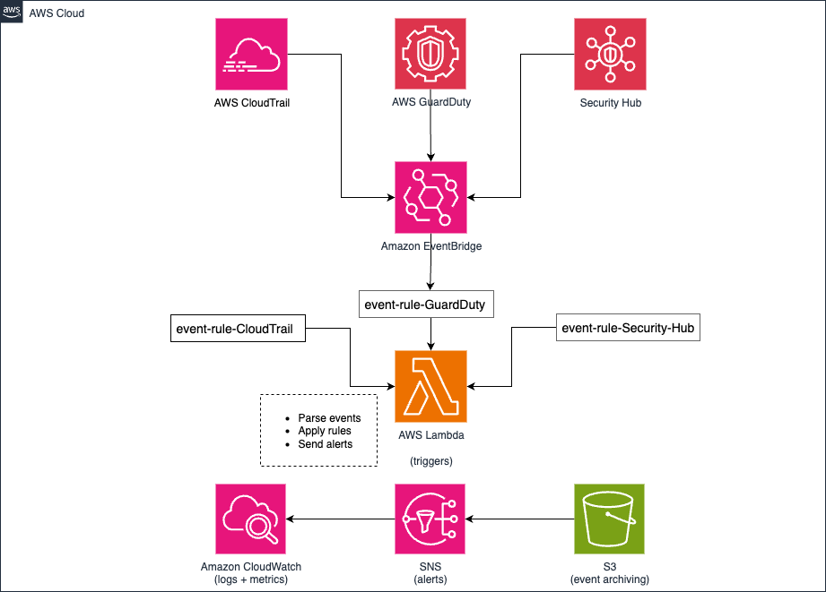

# 🛡️ CNAPP (Lite) Threat Detection Dashboard (AWS, Python, Terraform)

## 📌 Overview

This project implements a lightweight **Cloud-Native Application Protection Platform (CNAPP)** for AWS using modular **Terraform** and **Python Lambda**. It ingests threat data from **GuardDuty**, **Security Hub**, and **CloudTrail**, evaluates it, and provides real-time alerts and structured logging through **SNS**, **S3**, and **CloudWatch Logs**.

---

## 🎯 Key Features

- ⚙️ **Modular Terraform** for easy maintenance and extension
- 🧠 **Python Threat Evaluation Engine** in Lambda
- 🔁 **Event-Driven** via EventBridge rules triggered by GuardDuty and Security Hub findings
- 🪵 **Structured Logs** in CloudWatch and S3
- 🔔 **Real-Time Alerts** via SNS (email/SMS-ready)
- 💰 **Low-cost Operation** (~$10–$25/month depending on usage)

---

## 🧱 Architecture

> _High-level diagram of the CNAPP Lite stack:_



---

## 📁 Project Structure
cnapp_threat_detection_dashboard/
│
├── modules/
│   ├── cloudtrail/
│   ├── eventbridge/
│   ├── guardduty/
│   ├── lambda/
│   │   ├── threat_detection/
│   │   ├── build/
│   ├── iam/
│   ├── security_hub/
│   └── s3/
│
├── terraform/
│   ├── main.tf
│   ├── variables.tf
│   └── outputs.tf

---

## 🚀 Getting Started

### 📦 Requirements

- AWS CLI configured (`aws configure`)
- Terraform `1.5+`
- Python `3.13+`
- Zip utility (`zip` CLI or Python's `zipfile`)
- (Optional) SNS topic with subscribed email

---

### 🛠️ Deployment

1. **Package the Lambda**

```bash
cd modules/lambda
zip -r build/threat_detection.zip threat_detection

Deploy Infrastructure

cd ../../terraform
terraform init
terraform apply

Provide inputs (e.g., bucket names, regions, etc.) during or via terraform.tfvars.

⸻

✅ Testing the Threat Detection Workflow

Once deployed, you can test the CNAPP Lite system by simulating findings and verifying alerts:

🔍 1. Simulate a GuardDuty Finding

aws guardduty create-sample-findings \
  --detector-id <your-detector-id> \
  --finding-types "Recon:EC2/PortProbeUnprotectedPort"

  This triggers:
	•	✅ EventBridge rule
	•	✅ Lambda function execution
	•	✅ Logs in CloudWatch
	•	✅ Alert in SNS
	•	✅ Log object in S3

⸻

📜 2. Verify Outputs

	•	CloudWatch Logs:

Go to Lambda logs in CloudWatch to inspect threat evaluations.
	•	S3 Bucket:

Check for logs under:
s3://<your-bucket>/AWSLogs/<account_id>/...

	•	SNS Notification:
Confirm receipt of email or SMS alert.

🧼 Cleanup

To destroy the infrastructure:
terraform destroy -auto-approve

Author: Robert Wright
Cloud/Network Security Enthusiast | AWS Solutions Architect Associate | AWS Security Specialty
GitHub: @amaruxia42